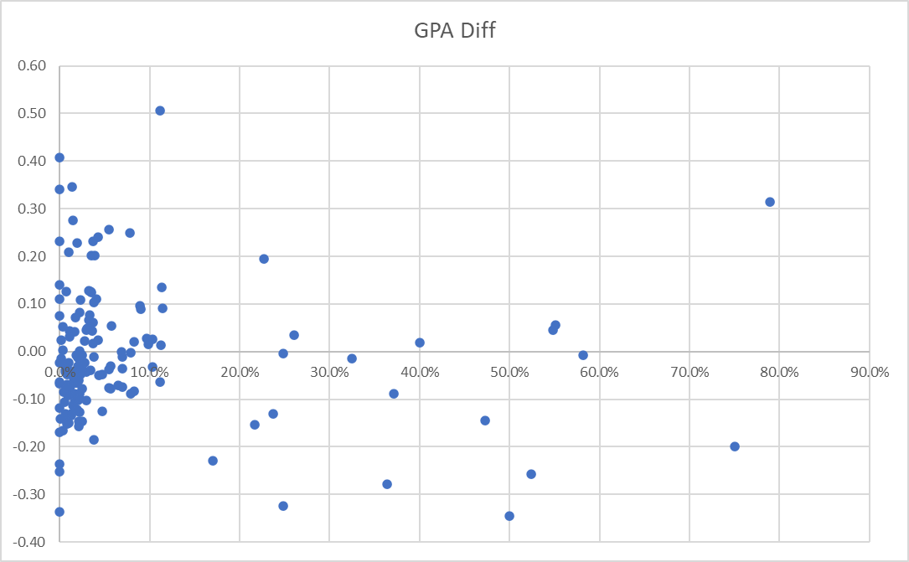

## Evidence on the relative performance of Not-Traditionally Submitted Outputs (NTOs) vs Traditional Outputs (TOs) in REF2021

This visualisation explores whether submitting a higher proportion of Not-Traditionally Submitted Outputs (NTOs) in REF2021 was associated changes to assessment outcomes. The work supports the aims of the [Hidden REF](https://hidden-ref.org/), which seeks to improve recognition for the full range of outputs and roles that contribute to excellent research.

Each point represents a university REF submission. The horizontal axis shows the proportion of outputs submitted as NTOs, while the vertical axis shows the difference between the submission’s **Outputs GPA** and its **Overall GPA**:

`GPA difference = Outputs GPA − Overall GPA`

A positive value means that the Outputs GPA was higher than the Overall GPA; a negative value means it was lower.

The results do not indicate a relative disadvantage for submissions with 5% or more NTOs (the threshold for the [Hidden REF's 5% Manifesto](https://hidden-ref.org/5-manifesto/)). The mean GPA difference for this group was −0.01, compared with −0.03 for submissions with fewer than 5% NTOs. Using a 3% threshold, submissions with at least 3% NTOs had a mean difference of +0.01, while those below 3% averaged −0.03.

Taken cautiously, these findings suggest that increasing the proportion of NTOs need not be associated with a relative penalty in Outputs GPA. They do not establish that NTOs improve performance, nor do they identify an optimal submission percentage. The apparent 3–5% “sweet spot” is an exploratory observation only, and may reflect factors not represented in the chart.

*Visualisation and description based on materials supplied by Simon Kerridge in June 2025*

Suggested reference:

  - The Hidden REF, *Evidence on the relative performance of Not-Traditionally Submitted Outputs (NTOs) vs Traditional Outputs (TOs) in REF2021* (2026) https://github.com/HiddenREF/NTO-vs-TO-relative-scoring
